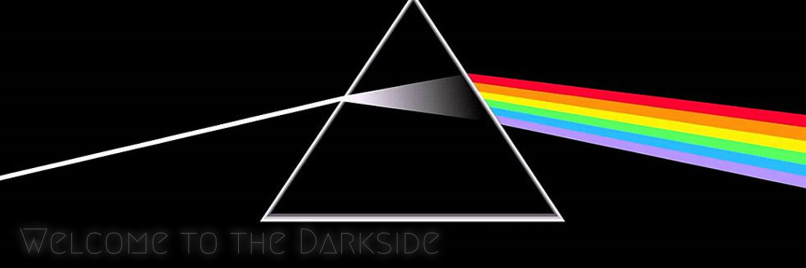

# Hello, I am Abraham 🐲

Full-Stack and Mobile Developer | Crafting Digital Excellence

-   🕸️ I’m currently working at a real estate company
-   🚀 I’m currently learning HTMX
-   📫 [abraham.agel@outlook.com](mailto:abraham.agel@outlook.com)
-   📷 is my hobby

## Me around the web 🌍

-   [LinkedIn](https://www.linkedin.com/in/abrahamanakagung)
-   [Twitter](https://twitter.com/anakagungcorp)
-   [Codepen](https://codepen.io/padunk/)
-   [Dev.to](https://dev.to/padunk)

## My tools 🧰

## Blogs ✍️

<!-- BLOG-POST-LIST:START -->
- [Solidity for JavaScript Developer](https://anakagung.com/blog/solidity-for-javascript-developer)
- [Lambda Infinite Loop: How To Avoid It.](https://anakagung.com/blog/lambda-infinite-loop-how-to-avoid-it)
- [How To Create React and Tailwind project with Vite](https://anakagung.com/blog/how-to-create-react-and-tailwind-project-with-vite)
- [How to Create Coding Blog with Sapper and Sanity from scratch](https://anakagung.com/blog/how-to-create-coding-blog-with-sapper-and-sanity-from-scratch)
<!-- BLOG-POST-LIST:END -->

## For Nerds 🤓
Note: this GitHub won't reflect my work since I use my company account to get busy.

## Proud Projects 💻

